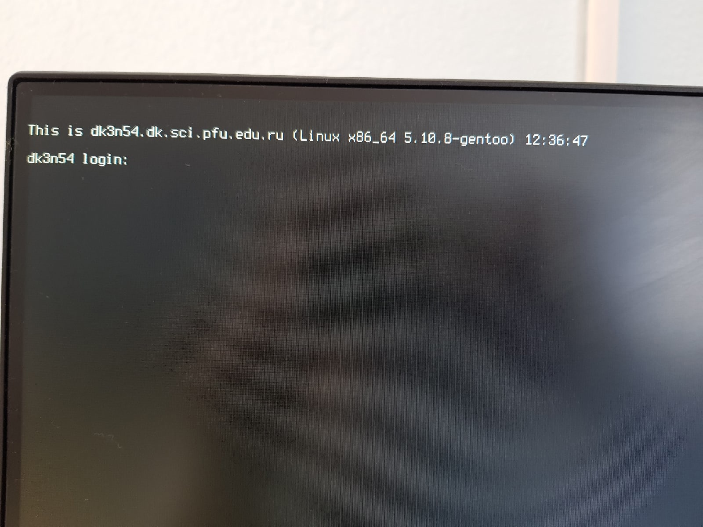
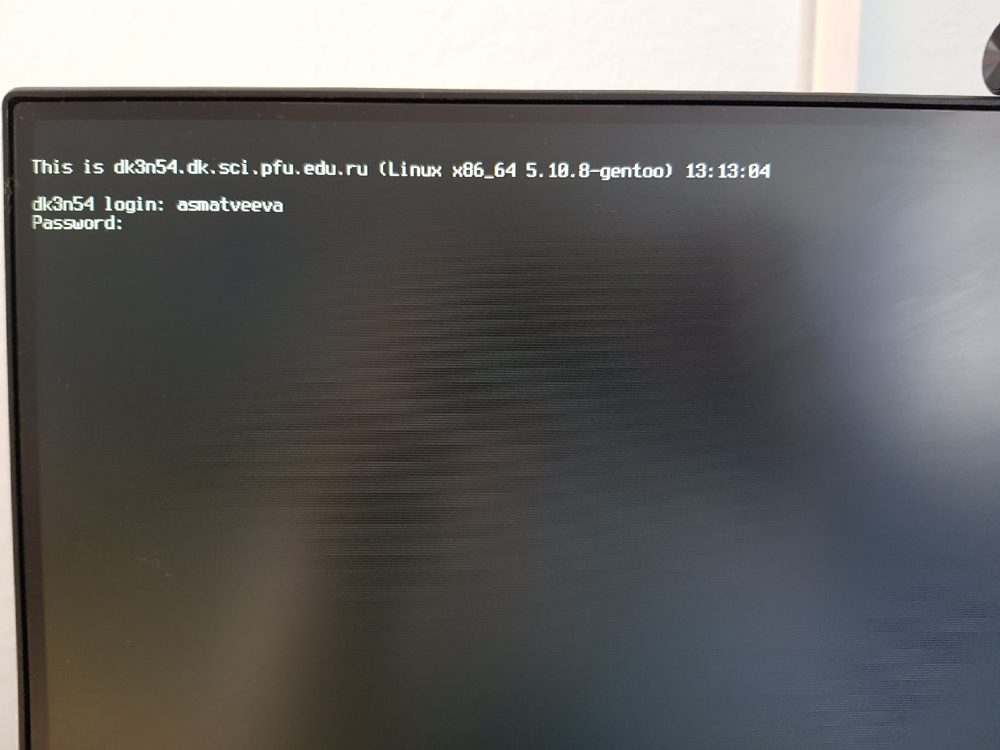
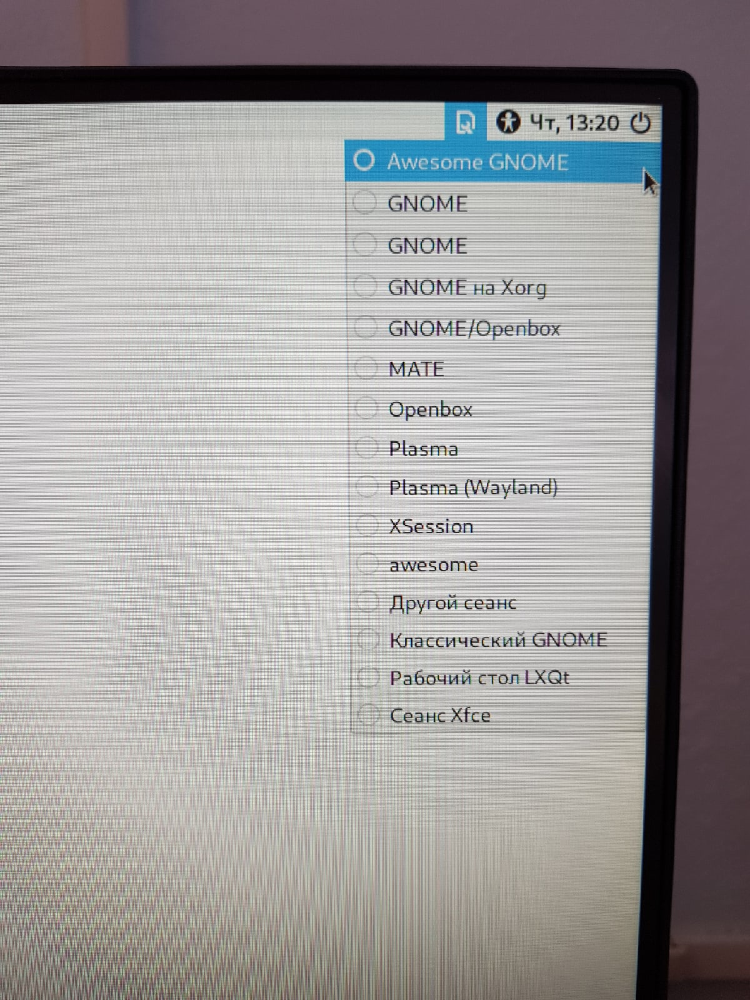
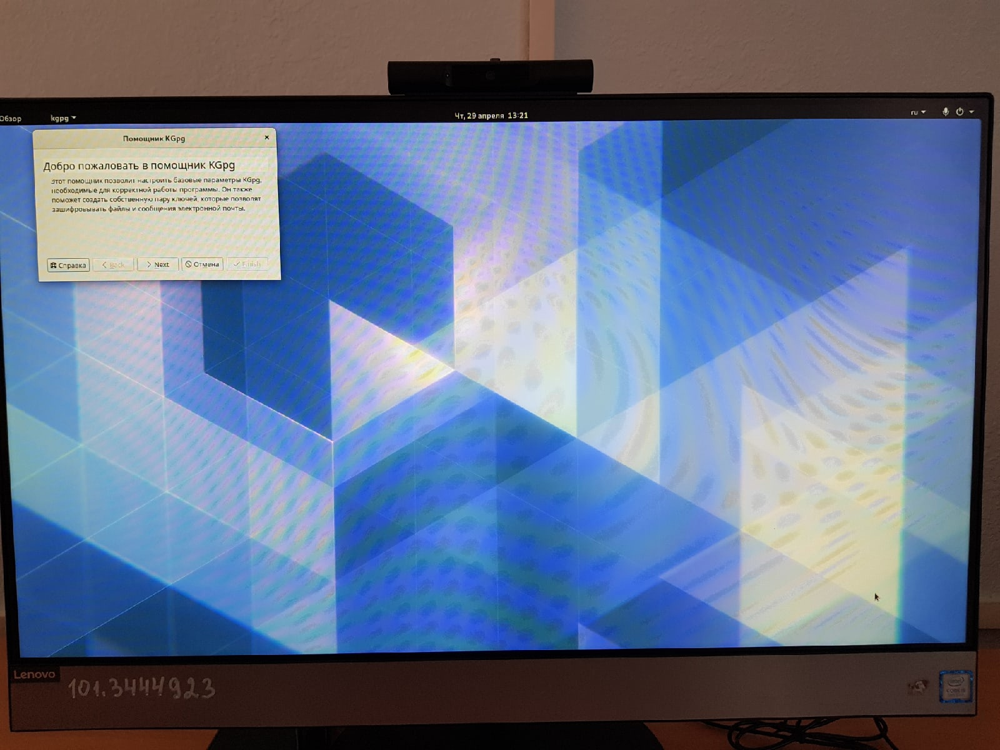
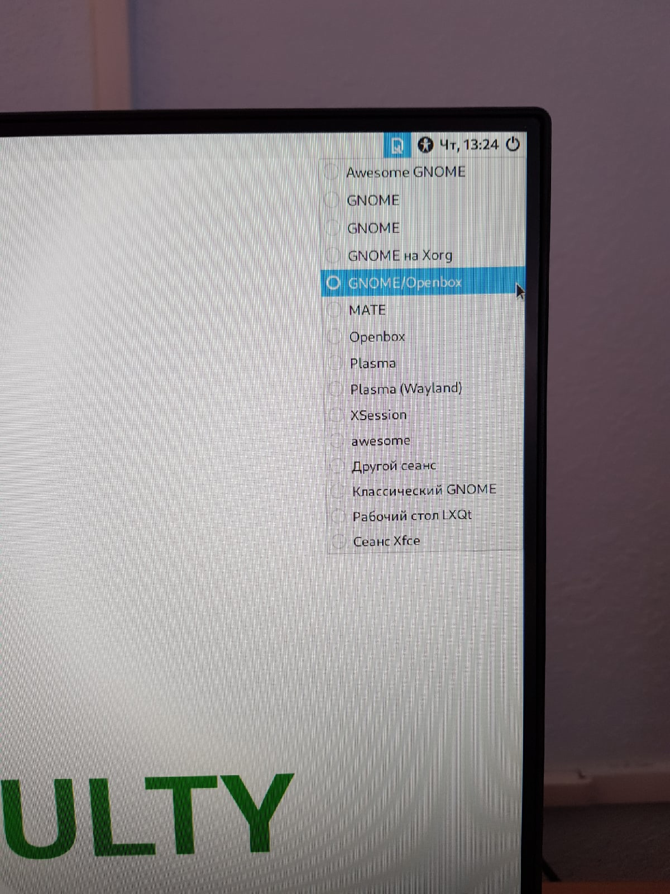
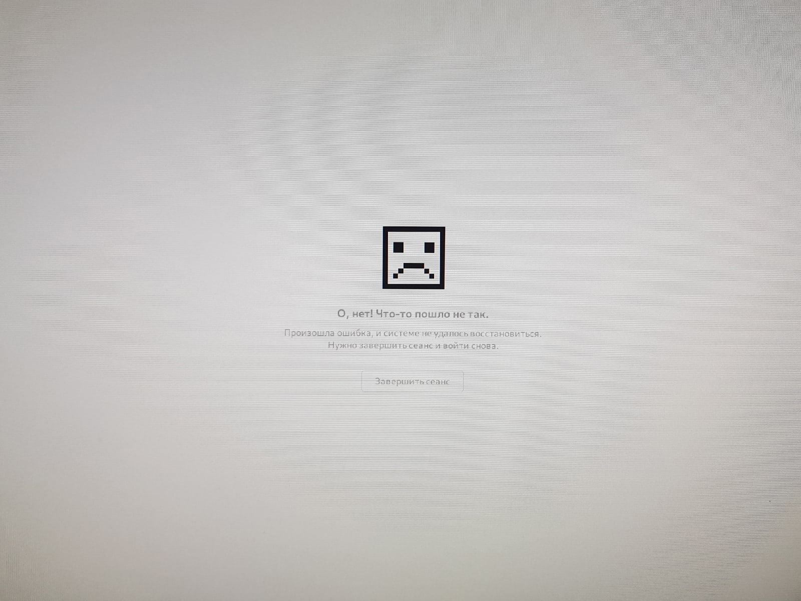
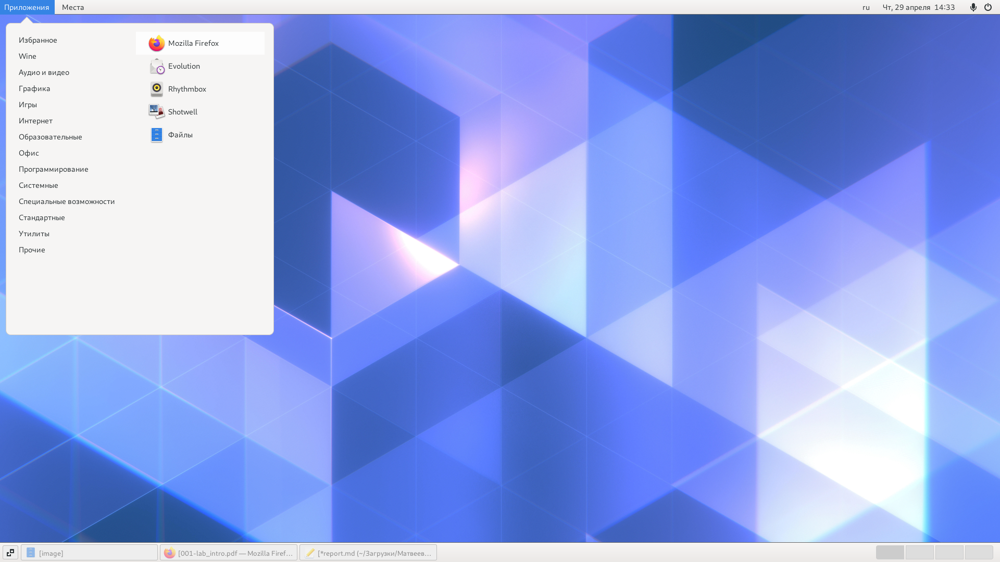
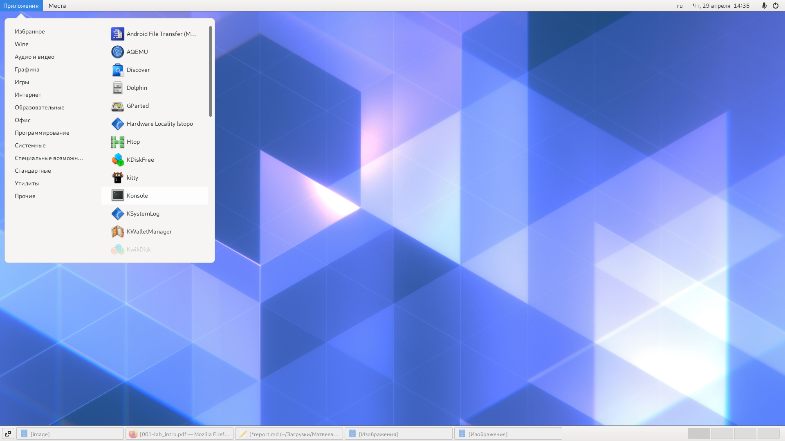

---
## Front matter
lang: ru-RU
title: Знакомство с операционной системой Linux
author: |
	Матвеева Анастасия Сергеевна НПМбд-02-20\inst{1}
institute: |
	\inst{1}RUDN University, Moscow, Russian Federation
date: 29 апреля, 2021, Москва, Россия

## Formatting
toc: false
slide_level: 2
theme: metropolis
header-includes: 
 - \metroset{progressbar=frametitle,sectionpage=progressbar,numbering=fraction}
 - '\makeatletter'
 - '\beamer@ignorenonframefalse'
 - '\makeatother'
aspectratio: 43
section-titles: true
---

# Цели и задачи работы 

## Цель лабораторной работы

Целью данной работы является познакомиться с операционной системой Linux,получить практические навыки работы с консолью и некоторыми графическими менеджерами рабочих столов операционной системы.

# Задание

1. Научиться переходить из графической консоли в текстовую и назад.

2. Научиться переходить из одной текстовой консоли в другую.

3. Изучить менеджеры рабочих столов. 

# Выполнение лабораторной работы

## Ознакомляемся с теоретическим материалом  загружаем компьютер.

 Переходим в одну из 6 текстовых консолей, используя Ctrl+Alt+Fn, где n=(1...6).
 
{ #fig:001 width=70% }

## Перемещаемся между текстовыми консолями, также используя cочетание клавиш Ctrl+Alt+Fn, где n=(1...6).

 Регистрируемся в текстовой консоли операционной системы, используя логин и пароль своей учётной записи. При этом заметим, что при наборе пароля на экран ничего не выводится.

{ #fig:002 width=70% }

## Завершаем консольный сеанс, используя сочетание клавиш Ctrl+D.

 Переключаемся на графический интерфейс, используя сочетание клавиш Ctrl+Alt+F7.

 Ознакомимся с менеджером рабочих столов и заметим, что по умолчанию стоит Классический GNOME.

{ #fig:003 width=70% }

## Регистрируемся в Awesome GNOME.

Переход в Awesome GNOME.

{ #fig:004 width=70% }

## Регистрируемся в Awesome GNOME.

Рабочий стол в Awesome GNOME

{ #fig:005 width=70% }

## Регистрируемся в XFCE.

Переход в XFCE

{ #fig:006 width=70% }

## Регистрируемся в XFCE.

Рабочий стол в XFCE

{ #fig:007 width=70% }

## К сожалению, на данном компьютере нет графического менеджера рабочего стола KDE и оконных менеджеров Openbox.

Переход в Openbox

{ #fig:008 width=70% }

## К сожалению, на данном компьютере нет графического менеджера рабочего стола KDE и оконных менеджеров Openbox.

Сообщение об ошибке

{ #fig:009 width=70% }

## Изучаем список установленных программ, и находим среди них браузер, текстовые редакторы и консоль.
 
 { #fig:010 width=70% }

## Изучаем список установленных программ, и находим среди них браузер, текстовые редакторы и консоль.
 
 { #fig:011 width=70% }

## Изучаем список установленных программ, и находим среди них браузер, текстовые редакторы и консоль.
 
 { #fig:012 width=70% }

# Вывод

Благодаря данной лабораторной работе мы познакомились с операционной системой Linux, а также получили практические навыки работы с консолью и некоторыми графическими менеджерами рабочих столов операционной системы.

