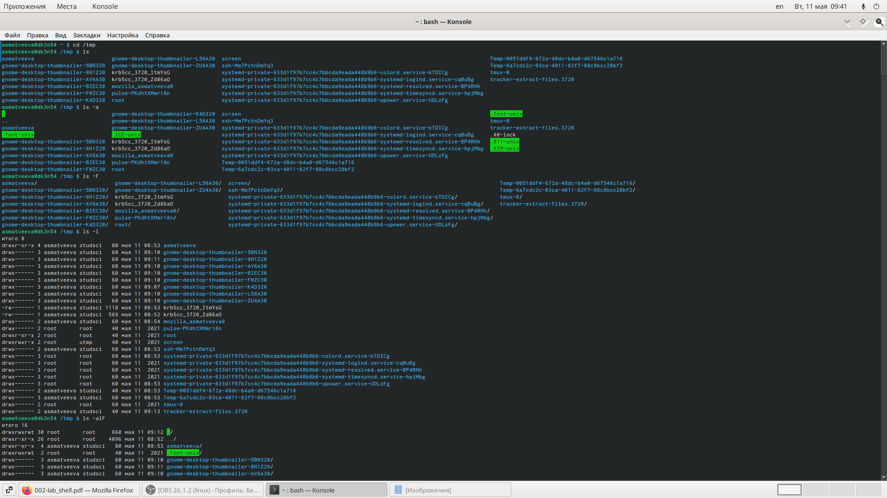
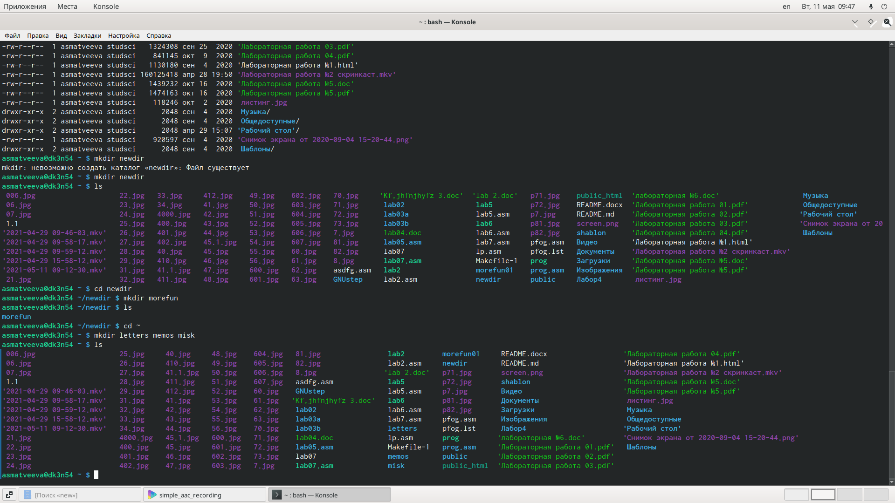
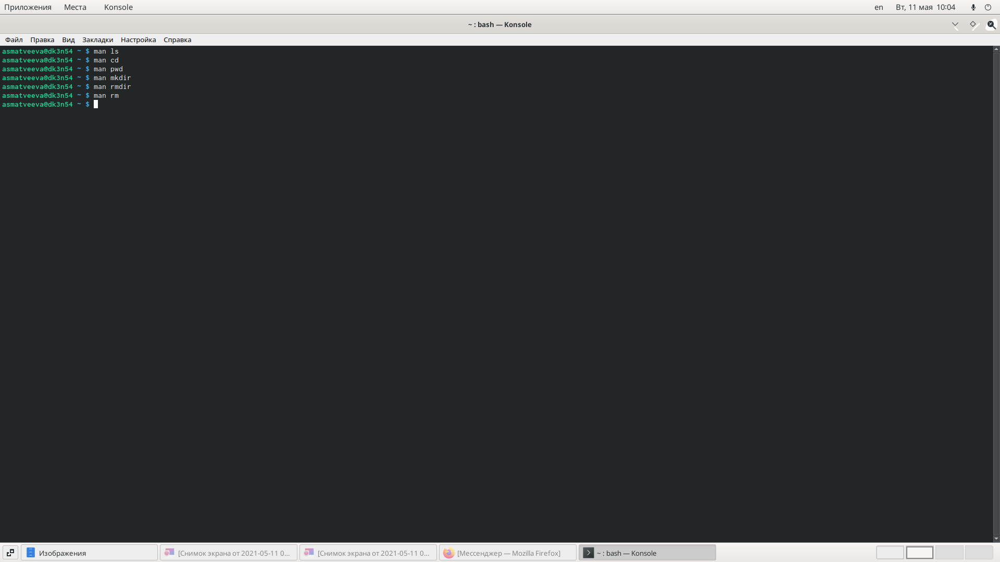

---
## Front matter
lang: ru-RU
title: Основы интерфейса взаимодействия пользователя с системой Unix на уровне командной строки
author: |
	Матвеева Анастасия Сергеевна НПМбд-02-20\inst{1}
institute: |
	\inst{1}RUDN University, Moscow, Russian Federation
date: 11 мая, 2021, Москва, Россия

## Formatting
toc: false
slide_level: 2
theme: metropolis
header-includes: 
 - \metroset{progressbar=frametitle,sectionpage=progressbar,numbering=fraction}
 - '\makeatletter'
 - '\beamer@ignorenonframefalse'
 - '\makeatother'
aspectratio: 43
section-titles: true
---

# Цель лабораторной работы

Целью данной работы является приобретение практических  навыков  взаимодействия пользователя с системой посредством командной строки.

# Задачи лабораторной работы

Задачи:

1. Научиться работать с системой с помощью командной строкой
2. Изучить команды cd, pwd, mkdir, rm, rmdir, history

# Выполнение лабораторной работы

## Выполнение лабораторной работы
Переходим в каталог /tmp, используя команду «cd /tmp» и выводим на экран содержимое каталога /tmp, используя команду «ls» с различными опциями (рис. -@fig:001):
 
{ #fig:001 width=70% }

Переходим в домашний каталог и выводим его содержимое.

## Выполнение лабораторной работы

В домашнем каталоге создадим новый каталог с именем newdir, а внутри него каталог morefun. Изучим команды удаления. 

Создаем три новых каталога и затем удаляем их. (рис. -@fig:002)

{ #fig:002 width=70% }

## Выполнение лабораторной работы

С помощью команды man определяем набор опций команд.(рис. -@fig:004)

{ #fig:011 width=70% }

Используя информацию, полученную при помощи команды history, выполните модификацию и исполнение нескольких команд из буфера команд.

# Выводы

Мы приобрели практические навыки взаимодействия с системой посредством командной строки.

