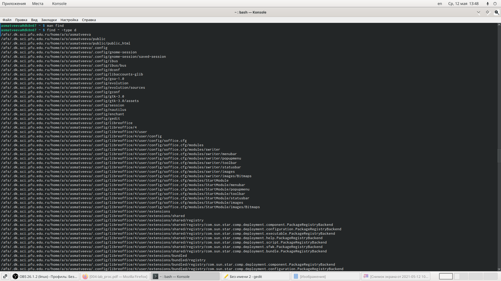

---
## Front matter
lang: ru-RU
title: Поиск файлов. Перенаправление ввода-вывода. Просмотр запущенных процессов
author: |
	Матвеева Анастасия Сергеевна НПМбд-02-20\inst{1}
institute: |
	\inst{1}RUDN University, Moscow, Russian Federation
date: 12 мая, 2021, Москва, Россия

## Formatting
toc: false
slide_level: 2
theme: metropolis
header-includes: 
 - \metroset{progressbar=frametitle,sectionpage=progressbar,numbering=fraction}
 - '\makeatletter'
 - '\beamer@ignorenonframefalse'
 - '\makeatother'
aspectratio: 43
section-titles: true
---

# Цель работы

Целью данной работы является oзнакомление  с  инструментами  поиска  файлов  и фильтрации текстовых данных. Приобретение практических навыков: по управлению процессами (и заданиями), по проверке использования диска и обслуживанию файловых систем.

# Задачи лабораторной работы
Задачи:

1. Изучить потоки ввода и вывода.
2. Изучить конвейер.
3. Изучить команду поиска файлов.
4. Изучить команду, позволяющую найти указанную строку символов.
5. Изучить команды по проверке использования диска.
6. В ходе работы использовать эти команды и интерпретировать их вывод.

# Выполнение лабораторной работы

## Выполнение лабораторной работы

Для того, чтобы записатьв файл file.txt названия файлов, содержащихся в каталоге /etc, использую команду «ls –a/etc> file.txt». Далее с помощью команды «ls -a~ >> file.txt» дописываюв этот же файл названия файлов, содержащихся в моем домашнем каталоге. Командой «cat file.txt» просматриваю  файл,  чтобы  убедиться  в  правильности действий. (рис. -@fig:001) 

{ #fig:001 width=70% }

## Выполнение лабораторной работы

Запускаем из консоли в фоновом режиме редактор gedit. Определите идентификатор процесса gedit, используя команду ps, конвейер и фильтр grep. Завершим процесс gedit командой kill6386. (рис. -@fig:002)

{ #fig:002 width=70% }

## Выполнение лабораторной работы

Вывожу имена  всех  директорий,имеющихся  в моем домашнем каталоге с помощью команды «find ~ -type d», предварительно получив информацию с помощью команды «man find» (рис. -@fig:003)

{ #fig:003 width=70% }

# Выводы

В  ходе  выполнения  данной  лабораторной  работы  я  изучила инструментыпоиска файлови фильтрации текстовых данных, а также приобрела  практические  навыки:  по  управлению  процессами  (и заданиями), по проверке использования диска и обслуживанию файловых систем.

