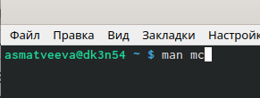
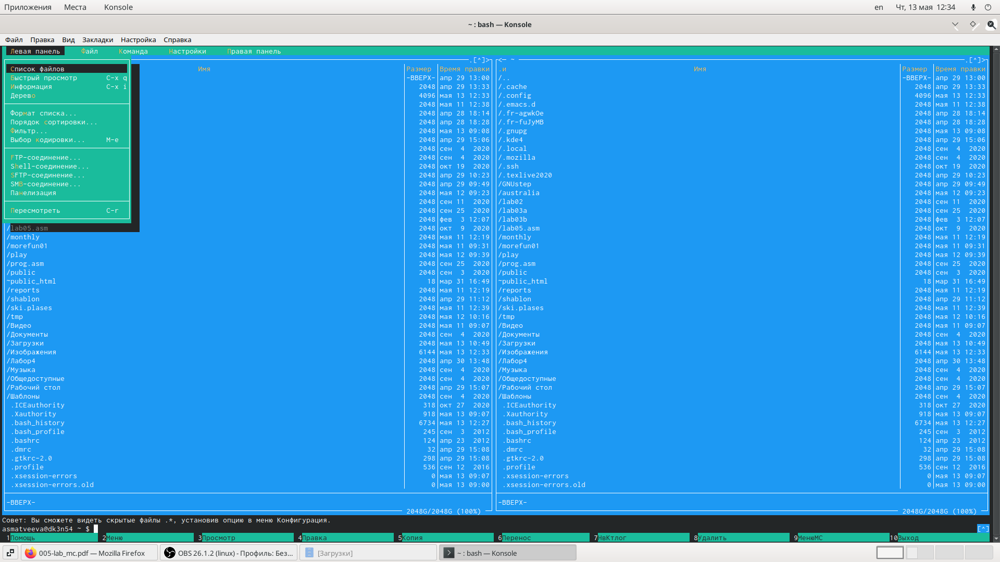
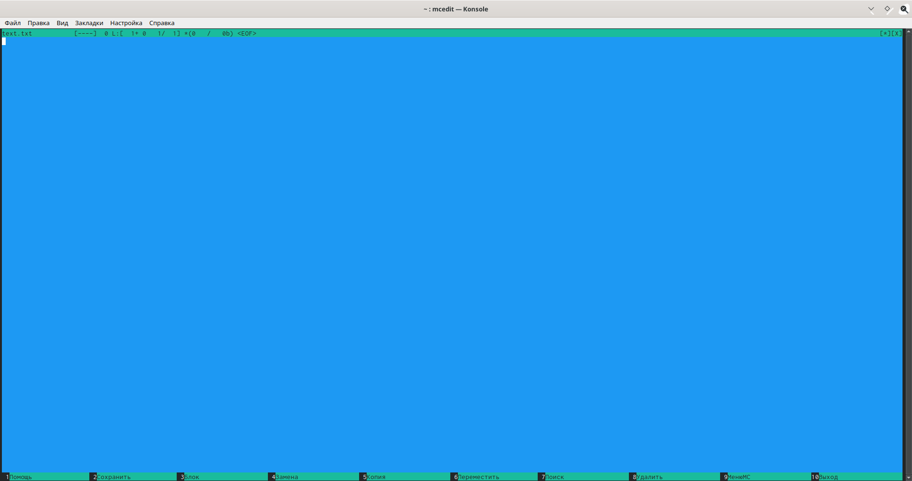

---
## Front matter
lang: ru-RU
title: Командная оболочка Midnight Commander
author: |
	Матвеева Анастасия Сергеевна НПМбд-02-20\inst{1}
institute: |
	\inst{1}RUDN University, Moscow, Russian Federation
date: 12 мая, 2021, Москва, Россия

## Formatting
toc: false
slide_level: 2
theme: metropolis
header-includes: 
 - \metroset{progressbar=frametitle,sectionpage=progressbar,numbering=fraction}
 - '\makeatletter'
 - '\beamer@ignorenonframefalse'
 - '\makeatother'
aspectratio: 43
section-titles: true
---

# Цель работы

Освоение основных возможностей командной оболочки Midnight Commander. Приобретение навыков практической работы по просмотру каталогов и файлов; манипуляций с ними.

## Задачи

1. Изучить командную оболочку mc.
2. Изучить меню панелей mc.
3. Изучить редактор mc.
4. В ходе работы выполнить все задания и интерпретировать их вывод.

## Выполнение лабораторной работы

Изучим информацию о mc, вызвав в командной строке man mc. (рис. -@fig:001) 

{ #fig:001 width=70% }

## Выполнение лабораторной работы

Изучим панели mc (Левая и Правая панели, Файл, Команда, Настройки), а также их команды. (рис. -@fig:002)

{ #fig:002 width=70% }

## Выполнение лабораторной работы

Откроем текстовый файл с помощью встроенного в mc редактора. (рис. -@fig:003)

{ #fig:003 width=70% }

## Вывод

В ходе выполнения данной лабораторной работы я освоила основные возможности командной оболочки Midnight Commander и приобрела навыки практической работы по просмотру каталогов и файлов; манипуляций с ними.

