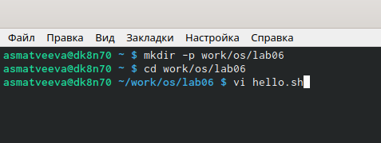
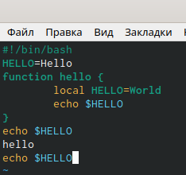
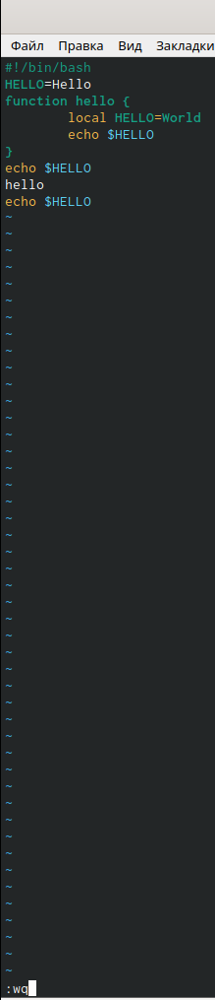

---
## Front matter
lang: ru-RU
title: Текстовой редактор vi
author: |
	Матвеева Анастасия Сергеевна НПМбд-02-20\inst{1}
institute: |
	\inst{1}RUDN University, Moscow, Russian Federation
date: 18 мая, 2021, Москва, Россия

## Formatting
toc: false
slide_level: 2
theme: metropolis
header-includes: 
 - \metroset{progressbar=frametitle,sectionpage=progressbar,numbering=fraction}
 - '\makeatletter'
 - '\beamer@ignorenonframefalse'
 - '\makeatother'
aspectratio: 43
section-titles: true
---

# Цель работы

Целью данной работы является знакомство с операционной системой Linux. Получить практические  навыки  работы  с  редактором vi, установленным  по умолчанию практически во всех дистрибутивах.

# Задачи лабораторной работы
Задачи:

1. Ознакомиться с операционной системой Linux.
2. Ознакомиться с редактором vi.
3. Изучить основные команды редактора vi.
4. В ходе работы использовать эти команды и интерпретировать их вывод.

# Выполнение лабораторной работы

## Выполнение лабораторной работы

Для начала создаём в домашней папке каталог work/os/lab06, используя команду «mkdir -p work/os/lab06», далее с помощью команды «cd work/os/lab06» переходим в созданный каталог и вызываем редактор vi командой «vi hello.sh» (рис. -@fig:001) 

{ #fig:001 width=70% }

## Выполнение лабораторной работы

Начинаем работу с редактором, а именно изучаем, как редактировать, вставлять, удалять и сохранять в редакторе vi (рис. -@fig:002)

{ #fig:002 width=50% }

## Выполнение лабораторной работы

Записываем произведённые изменения и выходим из vi, нажав «:», «w» и «q» (рис. -@fig:003)

{ #fig:003 width=50% }

# Выводы

В ходе выполнения данной лабораторной работы я познакомилась с операционной системой Linux и получилапрактические навыки работы с редактором vi.

