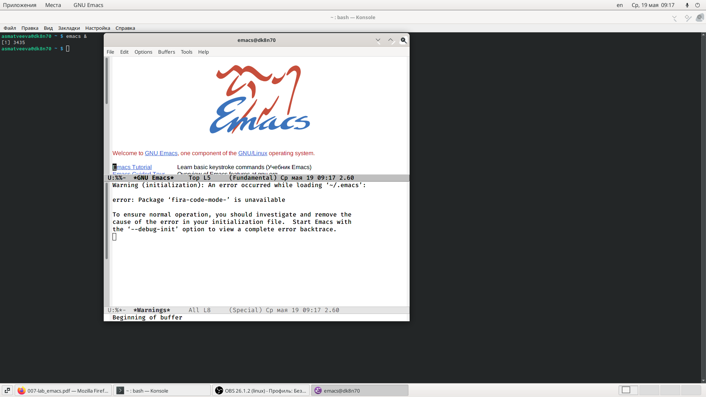
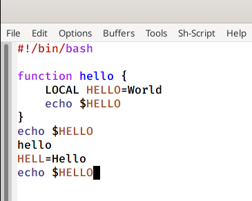
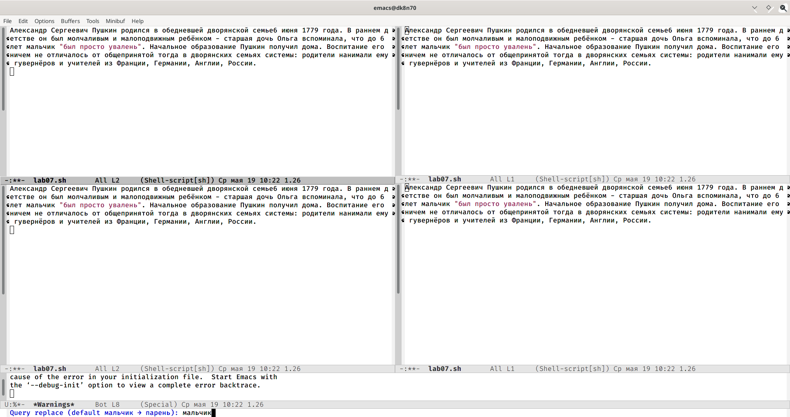

---
## Front matter
lang: ru-RU
title: Текстовой редактор Emacs
author: |
	Матвеева Анастасия Сергеевна НПМбд-02-20\inst{1}
institute: |
	\inst{1}RUDN University, Moscow, Russian Federation
date: 19 мая, 2021, Москва, Россия

## Formatting
toc: false
slide_level: 2
theme: metropolis
header-includes: 
 - \metroset{progressbar=frametitle,sectionpage=progressbar,numbering=fraction}
 - '\makeatletter'
 - '\beamer@ignorenonframefalse'
 - '\makeatother'
aspectratio: 43
section-titles: true
---

# Цель работы

Целью данной лабораторной работы является знакомство с операционной системой Linux. Получить практические навыки работы с редактором Emacs.

# Задачи лабораторной работы
Задачи:

1. Ознакомиться с операционной системой Linux.
2. Ознакомиться с редактором Emacs.
3. Изучить основные команды редактора Emacs.
4. В ходе работы использовать эти команды и интерпретировать их вывод.

# Выполнение лабораторной работы

## Выполнение лабораторной работы

Для начала открываем редактор Emacs с помощью команды «emacs &» и создаём в нём файл lab07.sh с помощью комбинации «Ctrl-x»«Ctrl-f» (рис. -@fig:001).

{ #fig:001 width=70% }

## Выполнение лабораторной работы

Начинаем работу с редактором, а именно изучаем, как редактировать, вставлять, удалять и сохранять в редакторе Emacs (рис. -@fig:002)/

{ #fig:002 width=50% }

## Выполнение лабораторной работы

Производим поиск и замену текста разными способами (рис. -@fig:003)

{ #fig:003 width=50% }

# Выводы

В ходе выполнения данной лабораторной работы я познакомилась с операционной системой Linuxи получила практические навыки работы с редактором Emacs.

