---
# Front matter
lang: ru-RU
title: "Отчёт по лабораторной работе №10"
subtitle: "Текстовый редактор Emacs"
author: "Матвеева Анастасия Сергеевна"

# Formatting
toc-title: "Содержание"
toc: true # Table of contents
toc_depth: 2
lof: true # List of figures
;lot: true # List of tables
fontsize: 12pt
linestretch: 1.5
papersize: a4paper
documentclass: scrreprt
polyglossia-lang: russian
polyglossia-otherlangs: english
mainfont: PT Serif
romanfont: PT Serif
sansfont: PT Sans
monofont: PT Mono
mainfontoptions: Ligatures=TeX
romanfontoptions: Ligatures=TeX
sansfontoptions: Ligatures=TeX,Scale=MatchLowercase
monofontoptions: Scale=MatchLowercase
indent: true
pdf-engine: lualatex
header-includes:
  - \linepenalty=10 # the penalty added to the badness of each line within a paragraph (no associated penalty node) Increasing the value makes tex try to have fewer lines in the paragraph.
  - \interlinepenalty=0 # value of the penalty (node) added after each line of a paragraph.
  - \hyphenpenalty=50 # the penalty for line breaking at an automatically inserted hyphen
  - \exhyphenpenalty=50 # the penalty for line breaking at an explicit hyphen
  - \binoppenalty=700 # the penalty for breaking a line at a binary operator
  - \relpenalty=500 # the penalty for breaking a line at a relation
  - \clubpenalty=150 # extra penalty for breaking after first line of a paragraph
  - \widowpenalty=150 # extra penalty for breaking before last line of a paragraph
  - \displaywidowpenalty=50 # extra penalty for breaking before last line before a display math
  - \brokenpenalty=100 # extra penalty for page breaking after a hyphenated line
  - \predisplaypenalty=10000 # penalty for breaking before a display
  - \postdisplaypenalty=0 # penalty for breaking after a display
  - \floatingpenalty = 20000 # penalty for splitting an insertion (can only be split footnote in standard LaTeX)
  - \raggedbottom # or \flushbottom
  - \usepackage{float} # keep figures where there are in the text
  - \floatplacement{figure}{H} # keep figures where there are in the text
---

# Цель работы

Познакомиться с операционной системой Linux. Получить практические навыки работы с редактором Emacs.

# Задачи лабораторной работы
Задачи:

1. Ознакомиться с операционной системой Linux.
2. Ознакомиться с редактором Emacs.
3. Изучить основные команды редактора Emacs.
4. В ходе работы использовать эти команды и интерпретировать их вывод.

# Выполнение лабораторной работы

1. Откроем редактор Emacs с помощью команды «emacs&» (рис. -@fig:001).

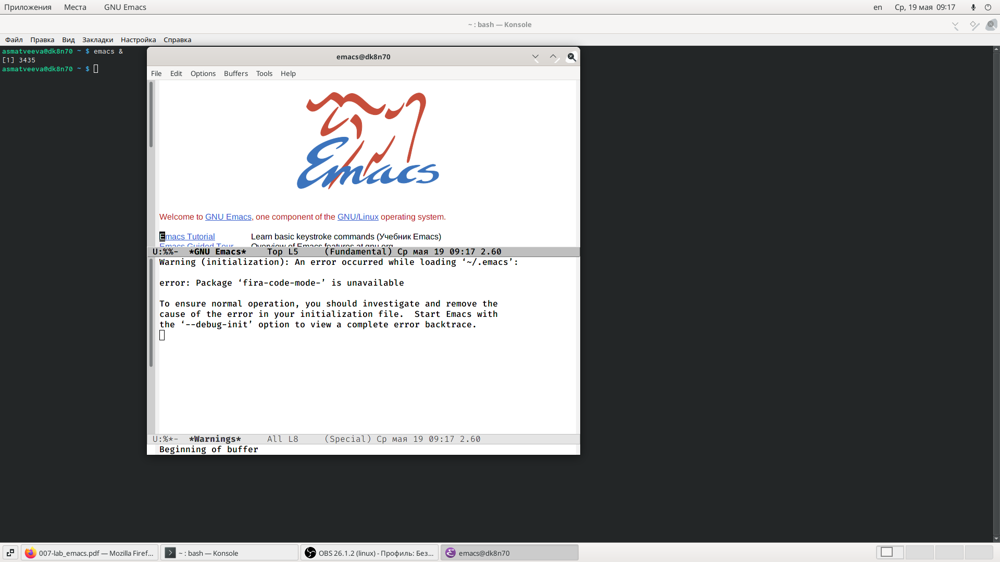{ #fig:001 width=70% }

2. Создадим файл lab07.sh с помощью комбинации «Ctrl-x»«Ctrl-f» (рис. -@fig:002). 

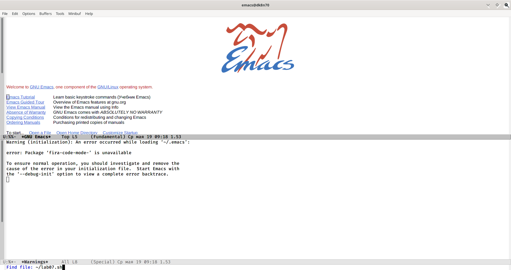{ #fig:002 width=70% }

3. В открывшемся буфере наберем необходимый текст (рис. -@fig:003). 

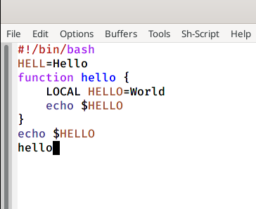{ #fig:003 width=70% }

4. Сохраним файл с помощью комбинации «Ctrl-x»«Ctrl-s».

5. 
1) Вырежем одной командой целую строку («Сtrl-k») (рис. -@fig:004).

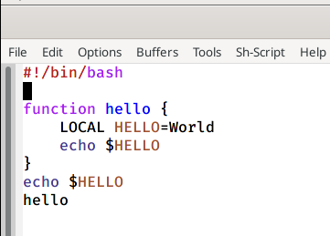{ #fig:004 width=70% }

2) Вставим эту строку в конец файла («Ctrl-y»)  (рис. -@fig:005). 

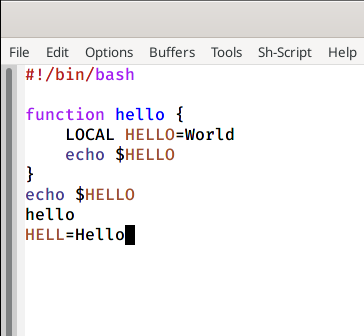{ #fig:005 width=70% }

3) Выделим область текста («Ctrl-space») (рис. -@fig:006).

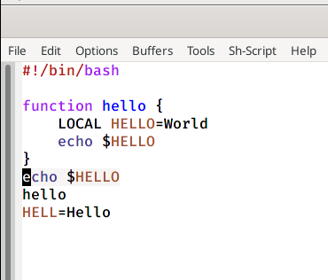{ #fig:006 width=70% }

4) Скопируем область в буфер обмена («Alt-w»).

5) Вставим область в конец файла («Ctrl-y») (рис. -@fig:007).
 
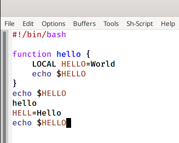{ #fig:007 width=70% }

6) Вновь выделим эту область(«Ctrl-space») и на этот раз вырежем её («Ctrl-w») (рис. -@fig:008, -@fig:009).

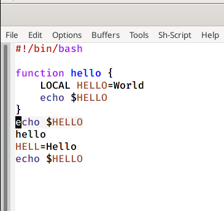{ #fig:008 width=70% }

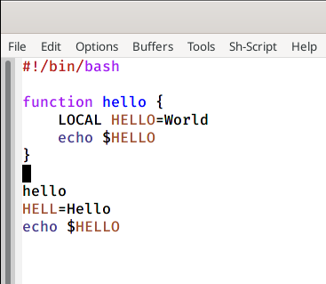{ #fig:009 width=70% }
 
 
7) Отменим последнее действие («Ctrl-/») (рис. -@fig:010).
   
{ #fig:010 width=70% } 
   
6. 
1) Переместим курсор в начало строки («Ctrl-a») (рис. -@fig:011, -@fig:012).

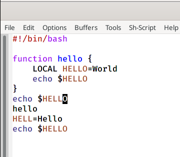{ #fig:011 width=70% } 

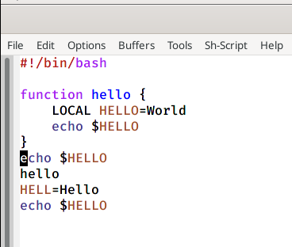{ #fig:012 width=70% } 

2) Переместим курсор в конец строки («Ctrl-e») (рис. -@fig:013). 

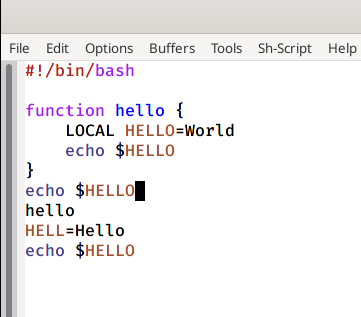{ #fig:013 width=70% } 

3) Переместим курсор в начало буфера («М-<») (рис. -@fig:014).

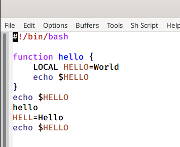{ #fig:014 width=70% } 

4) Переместим курсор в конец буфера («М->») (рис. -@fig:015). 

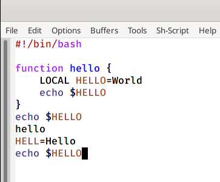{ #fig:015 width=70% } 

7. 
1) Выведем список  активных  буферов  на  экран  («Ctrl-x»«Ctrl-b»)  (рис. -@fig:016). 

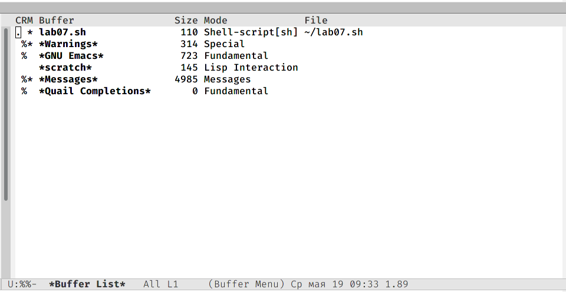{ #fig:016 width=70% } 

2) Переместимся во вновь открытое окно («Ctrl-x o») со  списком открытых буферов и переключимся на другой буфер (для этого необходимо нажать на «enter» после выбора необходимого буфера) (рис. -@fig:017).

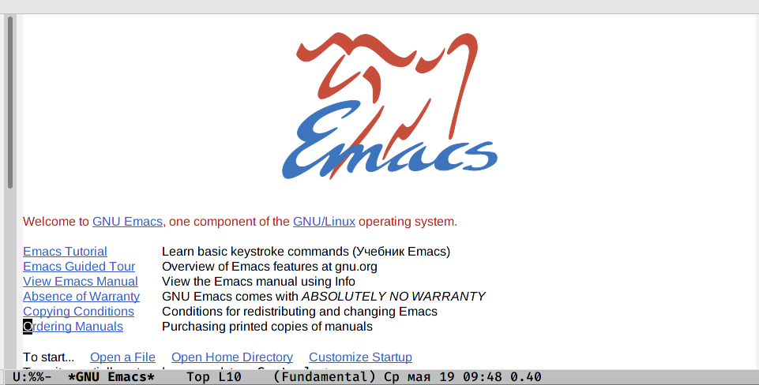{ #fig:017 width=70% } 

3) Закроем это окно («Ctrl-x0») (рис. -@fig:018).

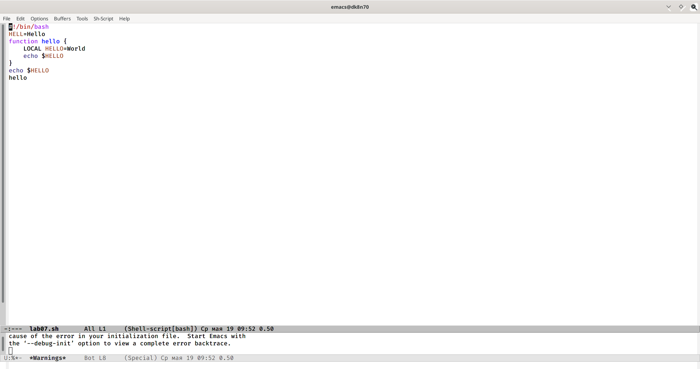{ #fig:018 width=70% } 

4) Теперь вновь переключимся между буферами, но уже без вывода их списка на экран («Ctrl-x b») (рис. -@fig:019)
.
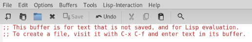{ #fig:019 width=70% } 

8. 
1) Поделим фрейм  на  4  части:  разделим  фрейм  на  два  окна  по вертикали («Ctrl-x 3»), а затем каждое из этих окон на две части по горизонтали («Ctrl-x 2») (рис. -@fig:020).

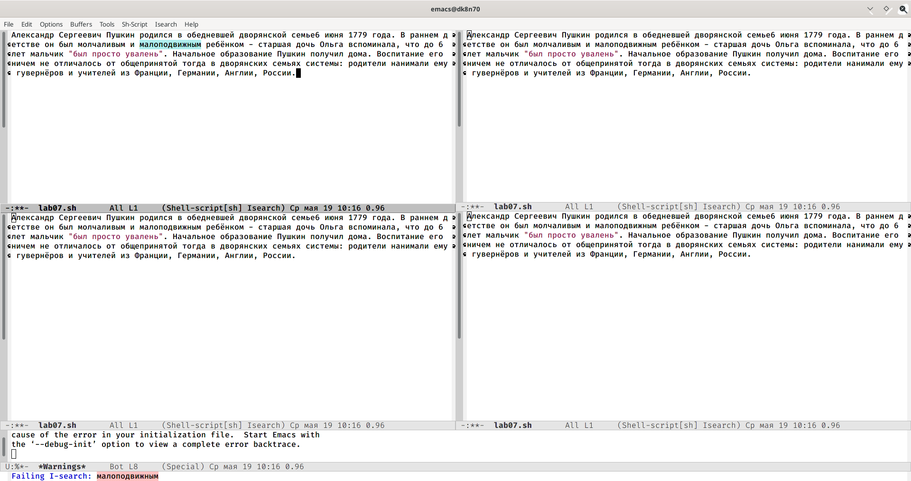{ #fig:020 width=70% }

2) В каждом из четырёх созданных окон откроем новый буфер и введем несколько строк текста (рис. -@fig:021).

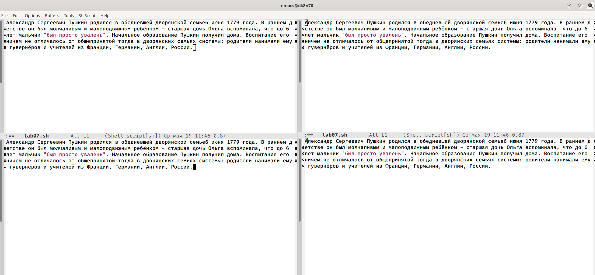{ #fig:021 width=70% }

9. 
1) Переключимся в режим поиска («Ctrl-s») и найдем несколько слов, присутствующих в тексте (рис. -@fig:022, -@fig:023).

{ #fig:022 width=70% }

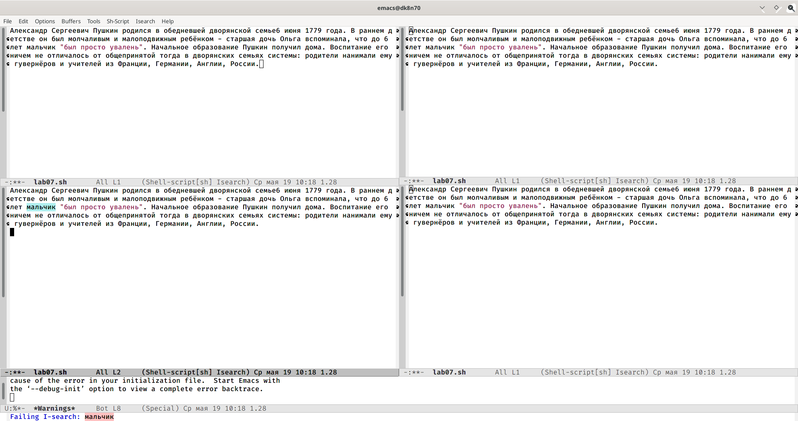{ #fig:023 width=70% }

2) Переключимся между  результатами  поиска,  нажимая «Ctrl-s» (рис. -@fig:024).

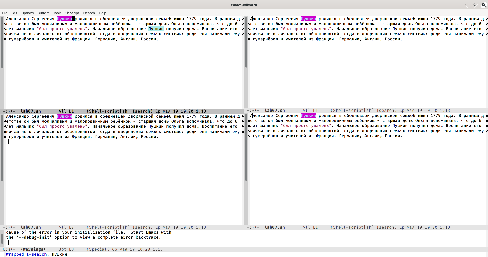{ #fig:024 width=70% }

3) Выйдем из режима поиска, нажав «Ctrl-g» (рис. -@fig:025).

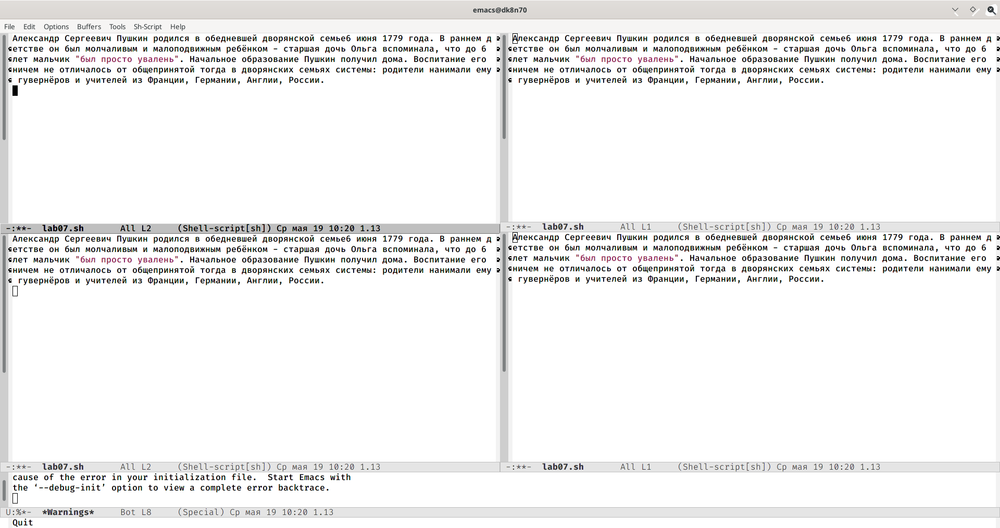{ #fig:025 width=70% }

4) Перейдем в  режим  поиска  и  замены  («М-%»),  введем текст, который следует найти и заменить, нажмем «enter», затем введем текст для  замены.  После  того  как  будут  подсвечены  результаты  поиска, нажмем «!» для подтверждения замены (рис. -@fig:026, -@fig:027, -@fig:028).

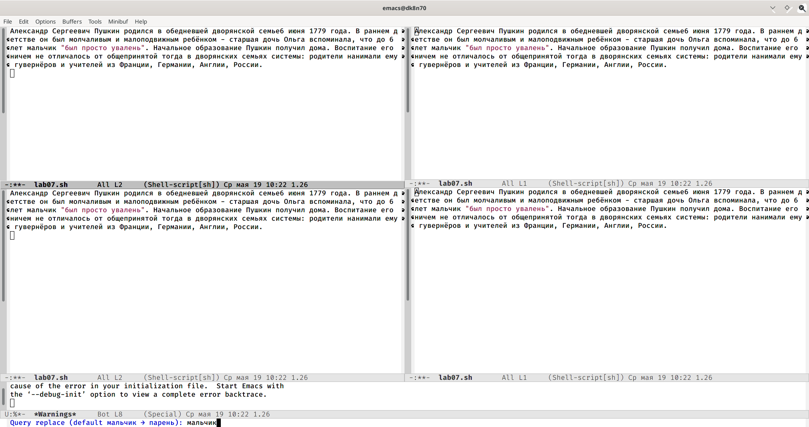{ #fig:026 width=70% }

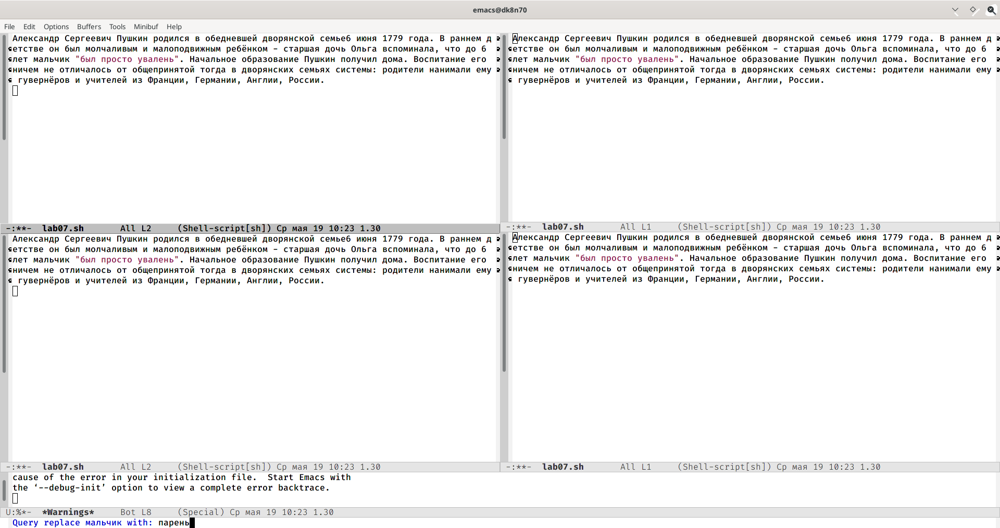{ #fig:027 width=70% }

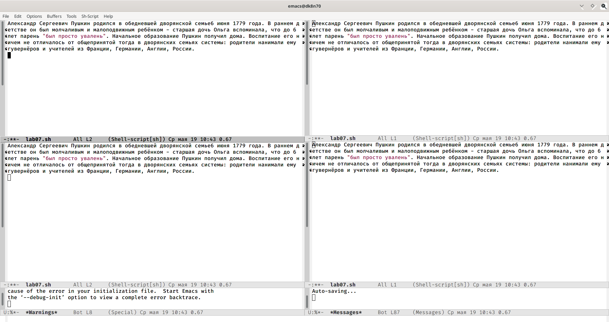{ #fig:028 width=70% }

5) К сожалению, на данном компьютере не удалось с помощью команды («М-s o») испробовать другой режим поиска, поэтому на предыдущем этапе была завершена лабораторная работа. Однако данный вид поиска отличается от обычного тем, что тут считывается строка поиска,  которая трактуется как  регулярное  выражение, и не осуществляется поиск точного совпадения в тексте буфера. Регулярное выражение − это образец, который обозначает набор строк, возможно, и неограниченный набор.

# Выводы

В ходе выполнения данной лабораторной работы я познакомилась с операционной системой Linuxи получила практические навыки работы с редактором Emacs.

# Ответы на контрольные вопросы
1. Emacs − один  из  наиболее  мощных  и  широко  распространённых редакторов,  используемых  в  мире Unix.  По  популярности  он соперничает с редактором vi и его клонами. В зависимости от ситуации, Emacs может быть:

- текстовым редактором;

- программой для чтения почты и новостей Usenet;

- интегрированной средой разработки (IDE);

- операционной системой и т.д.

Всё  это  разнообразие  достигается  благодаря  архитектуре Emacs, которая  позволяет  расширять  возможности  редактора  при  помощи языка Emacs  Lisp. На  языке C написаны  лишь  самые  базовые  и низкоуровневые  части Emacs, включая  полнофункциональный интерпретатор языка Lisp. Таким образом, Emacs имеет встроенный язык программирования, который может использоваться для настройки, расширения  и  изменения  поведения  редактора.  В  действительности, большая часть того редактора, с которым пользователи Emacs работают в наши дни,написана на языке Lisp.

2. Основную трудность для новичков при освоенииданного редактора могутсоставлять  большое  количество  команд,  комбинаций  клавиш, которые не получится все запомнить с первого раза и поэтому придется часто обращаться к справочным материалам.

3. Буфер –это  объект,  представляющий  собой  текст. Если  имеется несколько буферов, то редактировать можно только один. Обычно буфер считывает данные из файла или записывает в файл данные из буфера.Окно –это область экрана, отображающая буфер. При запуске редактора отображается одно окно, но при обращении к некоторым функциям могут открыться дополнительные окна. Окна Emacs и окна графической среды XWindow–разные вещи. Одно окно XWindow может быть разбито  на  несколько  окон  в  смысле Emacs,  в  каждом  из  которых отображается отдельный буфер.

4. Да, можно.

5. При запуске Emacs по умолчанию создаются следующие буферы:

- «scratch»(буфер для несохраненного текста)

- «Messages»(журнал ошибок, включающий также информацию, которая появляется в области EchoArea)

- «GNUEmacs»(справочный буфер о редакторе)

6. C-c |сначала, удерживая «ctrl»,нажимаю «c»,после –отпускаю обе клавишии нажимаю «|»
 C-cC-|сначала, удерживая «ctrl»,нажимаю «с», после –отпускаю обе клавиши и, удерживая «ctrl», нажимаю «|»
 
7. Чтобы  поделить  окно  на  две  части  необходимо  воспользоваться комбинацией «Ctrl-x 3»(по вертикали) или «Ctrl-x 2» (по горизонтали).

8. Настройки Emacs сохранятся в файле .emacs.

9. По  умолчанию  клавиша «←» удаляет  символ перед  курсором, нов редакторе  её  можно  переназначить.  Для  этого  необхдимоизменить конфигурацию файла .emacs.

10. Более удобным я считаю редактор emacs, потому что в нем проще открывать другие файлы, можно использовать сразу несколько окон, нет «Командного режима», «Режима ввода», «Режима командной строки», которые  являются  немного  непривычными  и  в  какой-то  степени неудобным
