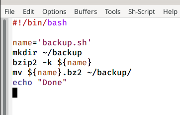
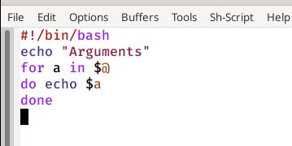
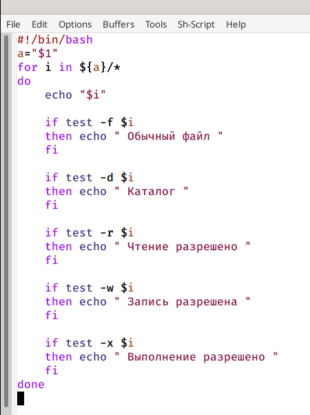
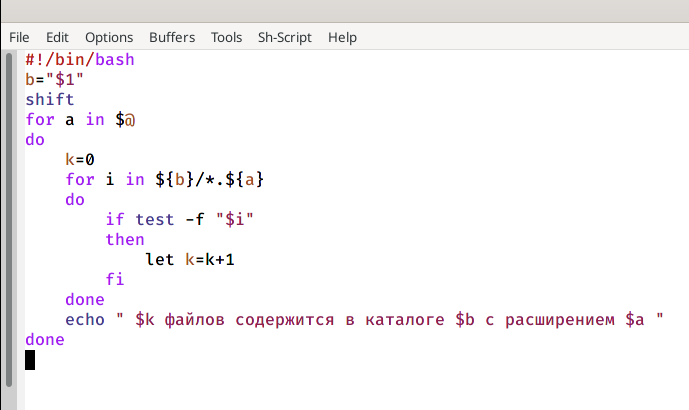

---
## Front matter
lang: ru-RU
title: Программирование в командном процессоре ОС UNIX. Командные файлы
author: |
	Матвеева Анастасия Сергеевна НПМбд-02-20\inst{1}
institute: |
	\inst{1}RUDN University, Moscow, Russian Federation
date: 26 мая, 2021, Москва, Россия

## Formatting
toc: false
slide_level: 2
theme: metropolis
header-includes: 
 - \metroset{progressbar=frametitle,sectionpage=progressbar,numbering=fraction}
 - '\makeatletter'
 - '\beamer@ignorenonframefalse'
 - '\makeatother'
aspectratio: 43
section-titles: true
---

# Цель работы

Изучить  основы  программирования  в  оболочке  ОС UNIX/Linux. Научиться писать небольшие командные файлы.

# Задачи лабораторной работы
Задачи:

1. Познакомиться с командными процессорами.
2. Изучить переменные, арифметические операторы в языке прграммирования bash.
3. Изучить операторы цикла for, while и until, оператор выбора case, условный оператор if.
4. В ходе работы написать 4 скрипта.

# Выполнение лабораторной работы

## Выполнение лабораторной работы

 Для начала напишем скрипт, который при запуске будет делать резервную копию самого себя (то есть файла, в котором содержится его исходный код) в другую директорию backup в домашнем каталоге. При этом файл должен архивироваться архиватором bzip2. После написания проверяем его работу. (рис. -@fig:001).

{ #fig:001 width=70% }

## Выполнение лабораторной работы

 Далее напишем пример командного файла, обрабатывающего любое произвольноечисло аргументов командной строки, в том числе превышающее десять и проверим его работу.(рис. -@fig:002)

{ #fig:002 width=50% }

## Выполнение лабораторной работы

 Теперь напишем командный файл — аналог команды ls (без использования самой этой команды и команды dir). Требуется, чтобы он выдавал информацию о нужном каталоге и выводил информацию о возможностях доступа к файлам этого каталога. Преверям работу данного скрипта (рис. -@fig:003)

{ #fig:003 width=50% }

## Выполнение лабораторной работы

 Напишем командный файл, который получает в качестве аргумента командной строки формат файла (.txt,.doc,.jpg,.pdfи т.д.) и вычисляет количество таких файлов в указанной директории. Путь к директории также передаётся ввиде аргумента командной строки. Также проверяем работу скрипта.(рис. -@fig:004)

{ #fig:004 width=50% }

# Выводы

В ходе выполнения данной лабораторной работы я изучила основы программирования  в  оболочке  ОС UNIX/Linux и  научилась писать небольшие командные файлы.

