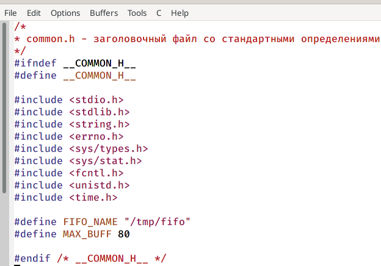
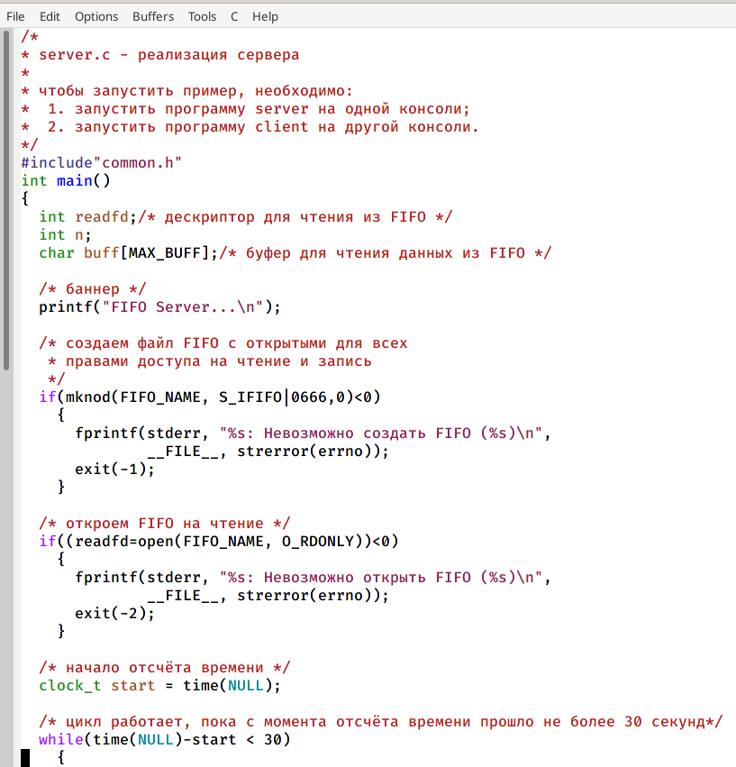
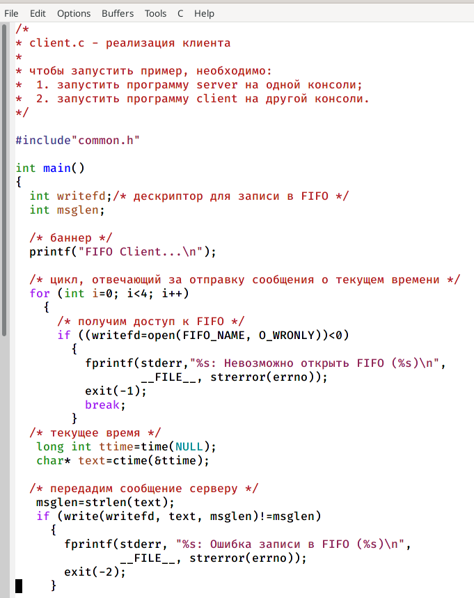
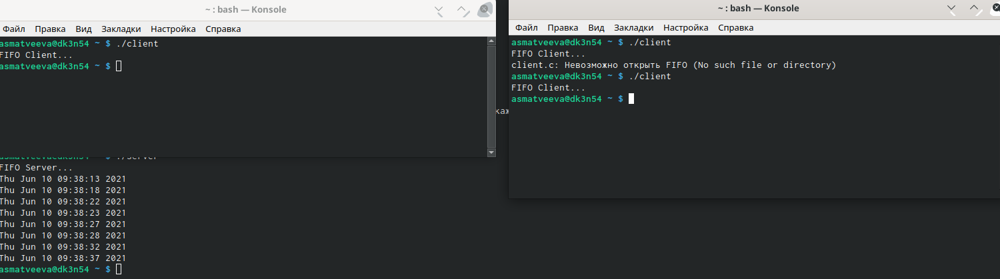

---
## Front matter
lang: ru-RU
title: Лабораторная работа №15
author: |
	Матвеева Анастасия Сергеевна НПМбд-02-20\inst{1}
institute: |
	\inst{1}RUDN University, Moscow, Russian Federation
date: 10 июня, 2021, Москва, Россия

## Formatting
toc: false
slide_level: 2
theme: metropolis
header-includes: 
 - \metroset{progressbar=frametitle,sectionpage=progressbar,numbering=fraction}
 - '\makeatletter'
 - '\beamer@ignorenonframefalse'
 - '\makeatother'
aspectratio: 43
section-titles: true
---

## Цель работы и задачи

Перед нами стоит цель - приобретение   практических   навыков   работы   с именованными каналами, а также следующие задачи:

1. Познакомиться с механизмом именованных каналов и принципом FIFO.
2. Изучить данные в задании файлы.
3. В ходе работы изменить программы таким образом, чтобы выполнялись требуемые условия.
4. Сделать выводы и выполнить отчет.

## Выполнение лабораторной работы

В ходе работы мы создали необходимые файлы. В файл common.h добавили стандартные заголовочные файлы unistd.h и time.h,  необходимые  для  работы  кодов  других  файлов. (рис. -@fig:001) 

{ #fig:001 width=70% }

## Выполнение лабораторной работы

В файл server.c добавили цикл while для контроля за временем работы сервера. Разница  между текущим  временем time(NULL) и  временем начала работы clock_t start=time(NULL) не должна превышать 30 секунд. (рис. -@fig:002)

{ #fig:002 width=70% }

## Выполнение лабораторной работы

В  файл client.c добавила  цикл,  который  отвечает  за  количество сообщений о текущем времени, и команду sleep(5) для приостановки работы клиента на 5 секунд. (рис. -@fig:003)

{ #fig:003 width=70% }

## Выполнение лабораторной работы

Далее проверили работу написанного кода. Отрыли  3  консоли терминала и  запустили:  в  первом  терминале − «./server», в остальных двух – «./client». В результате каждый терминал-клиент вывел по 4 сообщения. Спустя 30 секунд работа сервера была прекращена. (рис. -@fig:004)

{ #fig:004 width=70% }

## Вывод

В  ходе  выполнения  данной  лабораторной  работы  я  приобрела практические навыки работы с именованными каналами.

